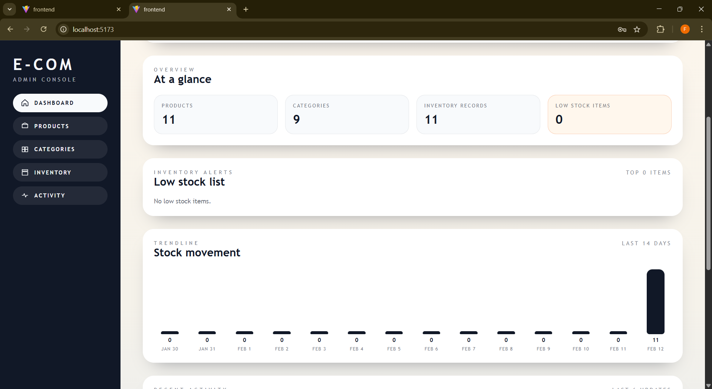
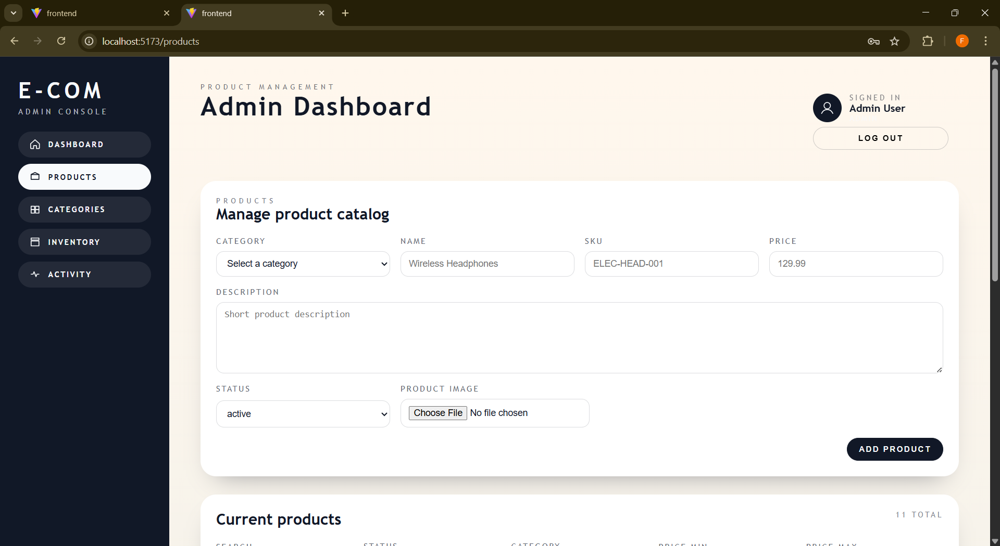

# E-commerce Product Management System

An admin-focused platform for managing an e-commerce catalog end-to-end. It combines a React admin console with a Laravel REST API to manage products, categories, inventory, audit history, and role-based access. The dashboard highlights low stock, recent activity, and stock movement trends.

## Screenshot

## Features

- Product, category, and inventory CRUD
- Role-based access control (admin, manager, editor)
- Audit log with filters
- Dashboard KPIs, low-stock alerts, and stock movement trends
- Profile management (update profile + password)
- Search and filters for products and inventory
- Local product image preview (not saved to backend)

## Tech Stack

- Frontend: React + Vite + plain CSS
- Backend: Laravel + Sanctum
- Database: MySQL

## Project Structure

- backend: Laravel API
- frontend: React admin UI
- postman: API collection

## Backend Setup (Laravel)

1. Copy and configure environment:
   - Copy .env.example to .env
   - Set DB_HOST, DB_PORT, DB_DATABASE, DB_USERNAME, DB_PASSWORD
2. Install dependencies:
   - composer install
3. Run migrations and seeders:
   - php artisan migrate --seed
4. Start the API server:
   - php artisan serve

API base URL: http://localhost:8000/api/v1

## Frontend Setup (React)

1. Install dependencies:
   - npm install
2. (Optional) Set API URL in frontend/.env:
   - VITE_API_URL=http://localhost:8000/api/v1
3. Start the dev server:
   - npm run dev

## Default Admin Accounts

- admin@example.com / password
- manager@example.com / password
- editor@example.com / password

## API Endpoints

Base: http://localhost:8000/api/v1

Auth & Profile
- POST /login
- GET /me
- POST /logout
- PUT /profile
- POST /profile/password

Categories
- GET /categories
- POST /categories
- GET /categories/{id}
- PUT /categories/{id}
- DELETE /categories/{id}

Products
- GET /products
- POST /products
- GET /products/{id}
- PUT /products/{id}
- DELETE /products/{id}

Inventory
- GET /inventories
- POST /inventories
- GET /inventories/{id}
- PUT /inventories/{id}
- DELETE /inventories/{id}

Admin Insights
- GET /dashboard
- GET /audit-logs

## Notes

- Seed data is included via Laravel seeders.
- CORS is enabled globally for local development.
